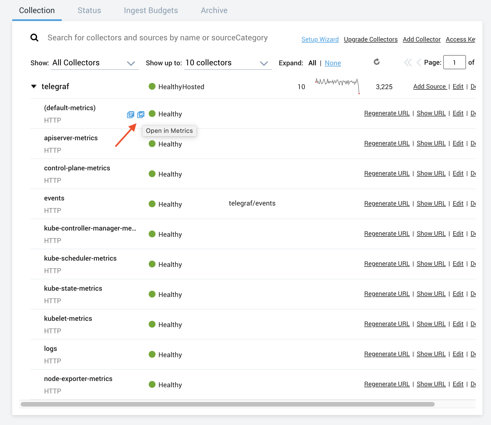
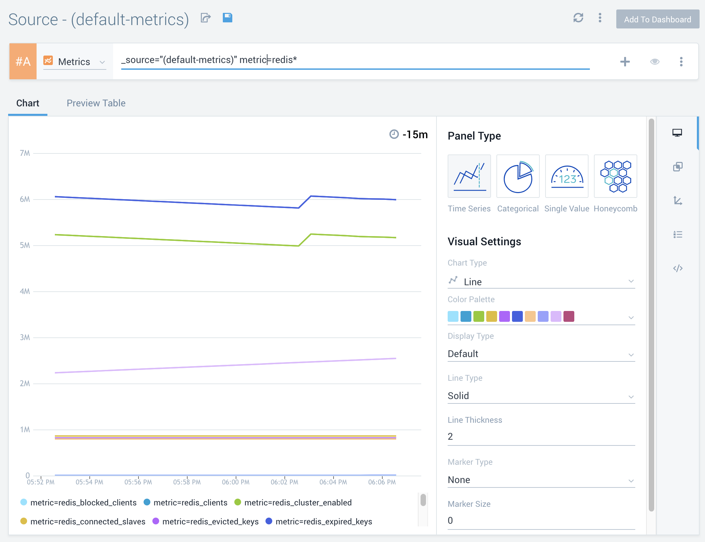

# Telegraf on k8s

* [Telegraf on k8s](#telegraf-on-k8s)
  * [Prerequisites](#prerequisites)
  * [Create k8s cluster via `eksctl`](#create-k8s-cluster-via-eksctl)
    * [AWS credentials for `eksctl`](#aws-credentials-for-eksctl)
    * [Run `eksctl create cluster`](#run-eksctl-create-cluster)
    * [Ensure `kubectl` works with created cluster](#ensure-kubectl-works-with-created-cluster)
  * [Deploy sumologic-kubernetes-collection on k8s cluster](#deploy-sumologic-kubernetes-collection-on-k8s-cluster)

## Prerequisites

* link for the HTTP Source created above ([Sumo Logic help](https://help.sumologic.com/03Send-Data/Sources/02Sources-for-Hosted-Collectors/HTTP-Source/zGenerate-a-new-URL-for-an-HTTP-Source))
* AWS credentials
* `eksctl`
* `helm` v3

## Create k8s cluster via `eksctl`

### AWS credentials for `eksctl`

Ensure you have AWS credentials ready in the environment

```
env | grep AWS_
AWS_REGION=<redacted>
AWS_ACCESS_KEY_ID=<redacted>
AWS_SECRET_ACCESS_KEY=<redacted>
AWS_SESSION_TOKEN=<redacted>
```

or you have a profile defined in `~/.aws/credentials` and set in environment

```
env | grep AWS_PROFILE
AWS_PROFILE=<redacted>
```

### Run `eksctl create cluster`

```
eksctl create cluster --config-file ./k8s/cluster.yaml
[ℹ]  eksctl version 0.30.0
[ℹ]  using region us-west-1
[ℹ]  setting availability zones to [us-west-1b us-west-1a us-west-1b]
[ℹ]  subnets for us-west-1b - public:192.168.0.0/19 private:192.168.96.0/19
[ℹ]  subnets for us-west-1a - public:192.168.32.0/19 private:192.168.128.0/19
[ℹ]  subnets for us-west-1b - public:192.168.64.0/19 private:192.168.160.0/19
[ℹ]  nodegroup "ng-1" will use "ami-002e04ca6d86d255e" [AmazonLinux2/1.18]
[ℹ]  using Kubernetes version 1.18
[ℹ]  creating EKS cluster "telegraf" in "us-west-1" region with un-managed nodes
[ℹ]  1 nodegroup (ng-1) was included (based on the include/exclude rules)
[ℹ]  will create a CloudFormation stack for cluster itself and 1 nodegroup stack(s)
[ℹ]  will create a CloudFormation stack for cluster itself and 0 managed nodegroup stack(s)
[ℹ]  if you encounter any issues, check CloudFormation console or try 'eksctl utils describe-stacks --region=us-west-1 --cluster=telegraf'
[ℹ]  CloudWatch logging will not be enabled for cluster "telegraf" in "us-west-1"
[ℹ]  you can enable it with 'eksctl utils update-cluster-logging --enable-types={SPECIFY-YOUR-LOG-TYPES-HERE (e.g. all)} --region=us-west-1 --cluster=telegraf'
[ℹ]  Kubernetes API endpoint access will use default of {publicAccess=true, privateAccess=false} for cluster "telegraf" in "us-west-1"
[ℹ]  2 sequential tasks: { create cluster control plane "telegraf", 2 sequential sub-tasks: { no tasks, create nodegroup "ng-1" } }
[ℹ]  building cluster stack "eksctl-telegraf-cluster"
[ℹ]  deploying stack "eksctl-telegraf-cluster"
[ℹ]  building nodegroup stack "eksctl-telegraf-nodegroup-ng-1"
[ℹ]  deploying stack "eksctl-telegraf-nodegroup-ng-1"
[ℹ]  waiting for the control plane availability...
[✔]  saved kubeconfig as "/Users/pmalek/.kube/config"
[ℹ]  no tasks
[✔]  all EKS cluster resources for "telegraf" have been created
[ℹ]  adding identity "arn:aws:iam::985071886926:role/eksctl-telegraf-nodegroup-ng-1-NodeInstanceRole-1TF1W28VB06N5" to auth ConfigMap
[ℹ]  nodegroup "ng-1" has 0 node(s)
[ℹ]  waiting for at least 1 node(s) to become ready in "ng-1"
[ℹ]  nodegroup "ng-1" has 3 node(s)
[ℹ]  node "ip-192-168-43-152.us-west-1.compute.internal" is not ready
[ℹ]  node "ip-192-168-48-77.us-west-1.compute.internal" is ready
[ℹ]  node "ip-192-168-62-130.us-west-1.compute.internal" is not ready
[ℹ]  kubectl command should work with "/Users/pmalek/.kube/config", try 'kubectl get nodes'
[✔]  EKS cluster "telegraf" in "us-west-1" region is ready
Execution time: 0h:18m:44s sec
```

This will create a cluster called `telegraf` in AWS region `us-west-1`.
This might take between 5 to 25 minutes approximately.

> **NOTE**:
> Remember to delete the cluster after you're done with the tutorial.
> You can do so with the following command
>
> ```
> eksctl delete cluster --name telegraf
> ```

### Ensure `kubectl` works with created cluster

Try running `kubectl get ns`, this should return a default set of namespaces
created in your cluster which will confirm have been set up correctly

```
NAME              STATUS   AGE
default           Active   23m
kube-node-lease   Active   23m
kube-public       Active   23m
kube-system       Active   23m
```

## Deploy sumologic-kubernetes-collection on k8s cluster

Now that we have our cluster working we can deploy
[Sumo Logic collection](https://github.com/SumoLogic/sumologic-kubernetes-collection/blob/release-v1.3/deploy/docs/Installation_with_Helm.md).
We're going to use `helm` to for this purpose.

First add helm repository

```
helm repo add sumologic https://sumologic.github.io/sumologic-kubernetes-collection

"sumologic" has been added to your repositories
```

And then install the collection via

```
helm upgrade --install my-release sumologic/sumologic --set sumologic.accessId=<SUMO_ACCESS_ID> --set sumologic.accessKey=<SUMO_ACCESS_KEY>  --set sumologic.clusterName="telegraf" --set telegraf-operator.enabled=true
Release "my-release" does not exist. Installing it now.
manifest_sorter.go:192: info: skipping unknown hook: "crd-install"
manifest_sorter.go:192: info: skipping unknown hook: "crd-install"
manifest_sorter.go:192: info: skipping unknown hook: "crd-install"
manifest_sorter.go:192: info: skipping unknown hook: "crd-install"
manifest_sorter.go:192: info: skipping unknown hook: "crd-install"
manifest_sorter.go:192: info: skipping unknown hook: "crd-install"
NAME: my-release
LAST DEPLOYED: Thu Oct 29 15:13:27 2020
NAMESPACE: default
STATUS: deployed
REVISION: 1
NOTES:
Thank you for installing sumologic.

A Collector with the name "telegraf" has been created in your Sumo Logic account.

Check the release status by running:
  kubectl --namespace default get pods -l "release=my-release"
WARNING: File persistence for fluentd is disabled. This might lead to loss of data in case of memory buffer overflow. We recommend turning this property on for production environments by setting fluentd.persistence.enabled=true
```

When the above finishes please confirm that collection's pods are running in the cluster

```
kubectl get pods
NAME                                                  READY   STATUS    RESTARTS   AGE
my-release-fluent-bit-gw88r                           1/1     Running   0          49s
my-release-fluent-bit-jx677                           1/1     Running   0          49s
my-release-fluent-bit-qxkc4                           1/1     Running   0          49s
my-release-kube-state-metrics-844f86b568-jxxfz        1/1     Running   0          48s
my-release-prometheus-node-exporter-d6s5n             1/1     Running   0          49s
my-release-prometheus-node-exporter-nx9tm             1/1     Running   0          49s
my-release-prometheus-node-exporter-xmhqs             1/1     Running   0          49s
my-release-prometheus-oper-operator-974f56f69-xrklz   1/1     Running   0          48s
my-release-sumologic-fluentd-events-0                 1/1     Running   0          48s
my-release-sumologic-fluentd-logs-0                   1/1     Running   0          48s
my-release-sumologic-fluentd-logs-1                   1/1     Running   0          48s
my-release-sumologic-fluentd-logs-2                   0/1     Running   0          48s
my-release-sumologic-fluentd-metrics-0                0/1     Running   0          48s
my-release-sumologic-fluentd-metrics-1                1/1     Running   0          48s
my-release-sumologic-fluentd-metrics-2                0/1     Running   0          48s
prometheus-my-release-prometheus-oper-prometheus-0    4/4     Running   1          21s
```

## Redis

### Deploy redis to cluster

```
kubectl create ns redis
namespace/redis created
```

```
kubectl -n redis apply -f ./k8s/redis/statefulset.yaml
statefulset.apps/redis created
```

Now you should observe that redis is running with telegraf sidecar inside the pod

```
kubectl describe pod -n redis redis-0
Name:         redis-0
Namespace:    redis
Priority:     0
Node:         ip-192-168-62-130.us-west-1.compute.internal/192.168.62.130
Start Time:   Thu, 29 Oct 2020 16:11:50 +0100
Labels:       app=redis
              controller-revision-hash=redis-5646c5c74f
              statefulset.kubernetes.io/pod-name=redis-0
Annotations:  kubernetes.io/psp: eks.privileged
              prometheus.io/port: 9273
              prometheus.io/scrape: true
              telegraf.influxdata.com/class: sumologic-prometheus
              telegraf.influxdata.com/inputs:
                [[inputs.redis]]
                servers = ["tcp://localhost:6379"]
              telegraf.influxdata.com/limits-cpu: 750m
Status:       Running
IP:           192.168.54.203
IPs:
  IP:           192.168.54.203
Controlled By:  StatefulSet/redis
Containers:
  redis:
    Container ID:   docker://fc0546c2aa16df2338e0e7c24588876a12e2616094243a5977d55341ca40fb93
    Image:          redis:alpine
    Image ID:       docker-pullable://redis@sha256:b0e84b6b92149194d99953e44f7d1fa1f470a769529bb05b4164eae60d8aea6c
    Port:           <none>
    Host Port:      <none>
    State:          Running
      Started:      Thu, 29 Oct 2020 16:11:51 +0100
    Ready:          True
    Restart Count:  0
    Environment:    <none>
    Mounts:
      /var/run/secrets/kubernetes.io/serviceaccount from default-token-59z2c (ro)
  telegraf:
    Container ID:   docker://3bdcfe60dc72f86de501a287acf408120233ba78db265b7bee9e7213c6247a34
    Image:          docker.io/library/telegraf:1.14.4
    Image ID:       docker-pullable://telegraf@sha256:f78008ce19c7e261d79da0c05c70d2368b848f448dfe23c12228c60c8de3768d
    Port:           <none>
    Host Port:      <none>
    State:          Running
      Started:      Thu, 29 Oct 2020 16:11:57 +0100
    Ready:          True
    Restart Count:  0
    Limits:
      cpu:     750m
      memory:  200Mi
    Requests:
      cpu:     10m
      memory:  10Mi
    Environment:
      NODENAME:   (v1:spec.nodeName)
    Mounts:
      /etc/telegraf from telegraf-config (rw)
      /var/run/secrets/kubernetes.io/serviceaccount from default-token-59z2c (ro)

...

Events:
  Type    Reason     Age   From               Message
  ----    ------     ----  ----               -------
  Normal  Scheduled  10m   default-scheduler  Successfully assigned redis/redis-0 to ip-192-168-62-130.us-west-1.compute.internal
  Normal  Pulled     10m   kubelet            Container image "redis:alpine" already present on machine
  Normal  Created    10m   kubelet            Created container redis
  Normal  Started    10m   kubelet            Started container redis
  Normal  Pulling    10m   kubelet            Pulling image "docker.io/library/telegraf:1.14.4"
  Normal  Pulled     10m   kubelet            Successfully pulled image "docker.io/library/telegraf:1.14.4"
  Normal  Created    10m   kubelet            Created container telegraf
  Normal  Started    10m   kubelet            Started container telegraf
```

### Observe redis metrics in Sumo

Open Collection view to observe that collector (named `telegraf` as designated
by `sumologic.clusterName` flag, passed to `helm`) with all its sources, has been
successfully created



Open the metrics view (as pointed out above) and observe redis metrics going into
Sumo. One can use the following query to filter only redis related metrics

```
_source="(default-metrics)" metric=redis*
```



##

## Tips and tricks


TODO