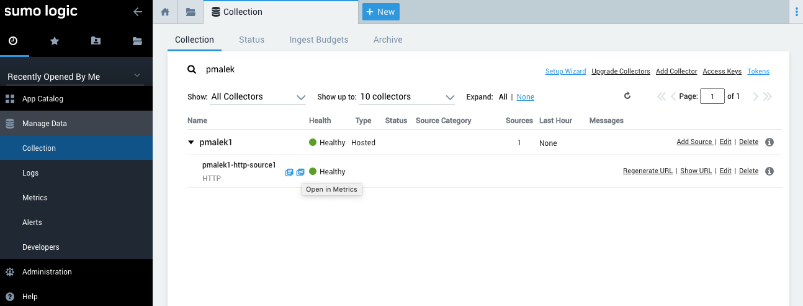
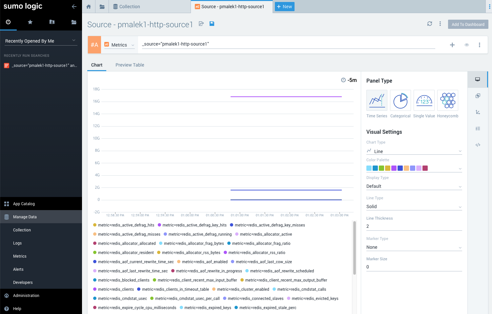
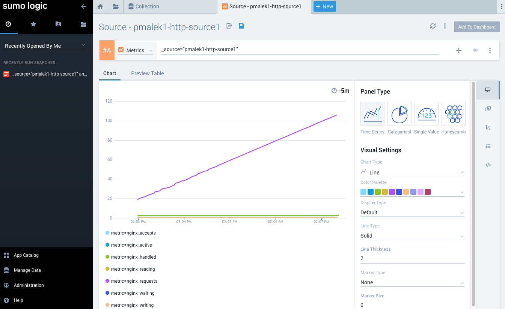
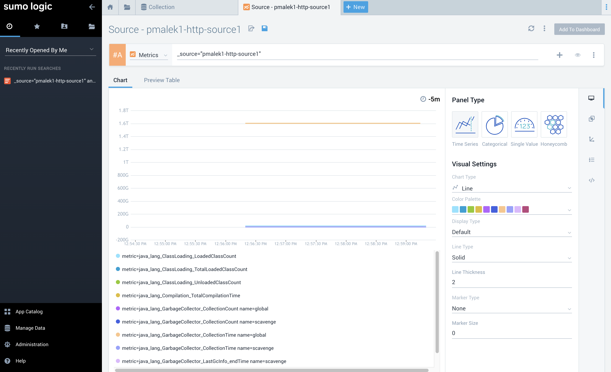

# Telegraf on non-k8s

* [Telegraf on non-k8s](#telegraf-on-non-k8s)
  * [Prerequisites](#prerequisites)
    * [Download Telegraf to local machine](#download-telegraf-to-local-machine)
      * [Mac](#mac)
      * [Linux](#linux)
  * [Redis](#redis)
    * [Start redis container](#start-redis-container)
    * [Telegraf configuration for redis](#telegraf-configuration-for-redis)
    * [Start telegraf to collect metrics from redis](#start-telegraf-to-collect-metrics-from-redis)
    * [Observe redis metrics in Sumo Logic](#observe-redis-metrics-in-sumo-logic)
  * [Nginx](#nginx)
    * [Start nginx container](#start-nginx-container)
      * [Add status page configuration to nginx](#add-status-page-configuration-to-nginx)
    * [Telegraf configuration for nginx](#telegraf-configuration-for-nginx)
    * [Start telegraf to collect metrics from nginx](#start-telegraf-to-collect-metrics-from-nginx)
    * [Observe nginx metrics in Sumo Logic](#observe-nginx-metrics-in-sumo-logic)
  * [JMX](#jmx)
    * [Start tomcat container with jolokia2 jvm agent](#start-tomcat-container-with-jolokia2-jvm-agent)
    * [Telegraf configuration for jolokia2 agent](#telegraf-configuration-for-jolokia2-agent)
    * [Start telegraf to collect metrics from jolokia2 jvm agent](#start-telegraf-to-collect-metrics-from-jolokia2-jvm-agent)
    * [Observe jolokia2 jvm metrics in Sumo Logic](#observe-jolokia2-jvm-metrics-in-sumo-logic)
  * [Tips and tricks](#tips-and-tricks)
    * [See the metrics sent in terminal](#see-the-metrics-sent-in-terminal)
    * [See more information about what's happening in telegraf](#see-more-information-about-whats-happening-in-telegraf)
  * [Common pitfalls](#common-pitfalls)
    * [`Error writing to outputs.sumologic`](#error-writing-to-outputssumologic)

## Prerequisites

* created [HTTP collector](https://help.sumologic.com/03Send-Data/Hosted-Collectors/Configure-a-Hosted-Collector)
* created [HTTP Source](https://help.sumologic.com/03Send-Data/Sources/02Sources-for-Hosted-Collectors/HTTP-Source#configure-an-http%C2%A0logs-and-metrics-source)
* link for the HTTP Source created above [help](https://help.sumologic.com/03Send-Data/Sources/02Sources-for-Hosted-Collectors/HTTP-Source/zGenerate-a-new-URL-for-an-HTTP-Source)

### Download Telegraf to local machine

After installing `telegraf` with below steps ensure you can run it

```
telegraf --version
Telegraf 1.16.0 (git: HEAD c2a53d0f)
```

#### Mac

```
brew update
brew install telegraf
```

#### Linux

Download telegraf from [`v1.16.0` release page](https://github.com/influxdata/telegraf/releases/tag/v1.16.0)
for your distro and architecture or install it via your distro's package manager.

## Redis

### Start redis container

Start `redis` in a docker container in a separate terminal window

```
docker run --rm --name redis -p 6379:6379 redis
1:C 26 Oct 2020 11:42:45.841 # oO0OoO0OoO0Oo Redis is starting oO0OoO0OoO0Oo
1:C 26 Oct 2020 11:42:45.841 # Redis version=6.0.8, bits=64, commit=00000000, modified=0, pid=1, just started
1:C 26 Oct 2020 11:42:45.841 # Warning: no config file specified, using the default config. In order to specify a config file use redis-server /path/to/redis.conf
1:M 26 Oct 2020 11:42:45.842 * Running mode=standalone, port=6379.
1:M 26 Oct 2020 11:42:45.842 # WARNING: The TCP backlog setting of 511 cannot be enforced because /proc/sys/net/core/somaxconn is set to the lower value of 128.
1:M 26 Oct 2020 11:42:45.842 # Server initialized
1:M 26 Oct 2020 11:42:45.843 * Ready to accept connections
...
```

### Telegraf configuration for redis

Official `redis` input plugin documentation can be found at https://github.com/influxdata/telegraf/tree/master/plugins/inputs/redis.

Put the below configuration to a local file e.g. [redis.conf](/non-k8s/redis/redis.conf)

```conf
[agent]
  interval = "3000ms"
  flush_interval = "3000ms"

[[inputs.redis]]
  servers = ["tcp://localhost:6379"]

[[outputs.sumologic]]
  ## Unique URL generated for your HTTP Metrics Source.
  ## This is the address to send metrics to.
  # url = "https://events.sumologic.net/receiver/v1/http/<UniqueHTTPCollectorCode>"

  data_format = "prometheus"
```

Substitute `url` in `sumologic` output plugin section with the URL that you got When
creating HTTP Source at sumologic

### Start telegraf to collect metrics from redis

```
telegraf --config ./non-k8s/redis/redis.conf
2020-10-26T11:42:47Z I! Starting Telegraf 1.16.0
2020-10-26T11:42:47Z I! Loaded inputs: redis
2020-10-26T11:42:47Z I! Loaded aggregators:
2020-10-26T11:42:47Z I! Loaded processors:
2020-10-26T11:42:47Z I! Loaded outputs: sumologic
2020-10-26T11:42:47Z I! Tags enabled: host=pmalek-mac
2020-10-26T11:42:47Z I! [agent] Config: Interval:3s, Quiet:false, Hostname:"pmalek-mac", Flush Interval:3s
...
```

### Observe redis metrics in Sumo Logic

Find your HTTP source in `Collection` view



Open its metrics view and validate that metrics are coming to Sumo



## Nginx

### Start nginx container

#### Add status page configuration to nginx

In order to make `nginx` expose metrics on status page add the following configuration
to a `.conf` file in `/etc/nginx/conf.d/`.

```
location /nginx_status {
    stub_status on;
    access_log  on;
    allow all;  # REPLACE with your access policy
}
```

If one would like to add the above to `/etc/nginx/conf.d/default.conf`, final
version of this file should look like this

```
server {
    listen       80;
    listen  [::]:80;
    server_name  localhost;

    location / {
        root   /usr/share/nginx/html;
        index  index.html index.htm;
    }

    error_page   500 502 503 504  /50x.html;
    location = /50x.html {
        root   /usr/share/nginx/html;
    }

    location /nginx_status {
        stub_status on;
        access_log  on;
        allow all;  # REPLACE with your access policy
    }
}
```

Using `docker` to achieve this we can add the provided status `conf` file to
container's directory tree via the following set of flags when starting the container

```
docker run --name nginx --rm -it -p 8080:80 -v $(pwd)/non-k8s/nginx/default/:/etc/nginx/conf.d/ nginx:1.19-alpine
/docker-entrypoint.sh: /docker-entrypoint.d/ is not empty, will attempt to perform configuration
/docker-entrypoint.sh: Looking for shell scripts in /docker-entrypoint.d/
/docker-entrypoint.sh: Launching /docker-entrypoint.d/10-listen-on-ipv6-by-default.sh
10-listen-on-ipv6-by-default.sh: error: /etc/nginx/conf.d/default.conf is not a file or does not exist
/docker-entrypoint.sh: Launching /docker-entrypoint.d/20-envsubst-on-templates.sh
/docker-entrypoint.sh: Configuration complete; ready for start up
...
```

At this point we should get the following when sending a request to the server via `curl`

```
curl http://localhost:8080/nginx_status
Active connections: 1
server accepts handled requests
 1 1 1
Reading: 0 Writing: 1 Waiting: 0
```

### Telegraf configuration for nginx

Official `nginx` input plugin documentation can be found at https://github.com/influxdata/telegraf/tree/master/plugins/inputs/nginx.

Put the below configuration to a local file e.g. [nginx.conf](/non-k8s/nginx/nginx.conf)

```conf
[agent]
  interval = "3000ms"
  flush_interval = "3000ms"

[[inputs.nginx]]
  urls = ["http://localhost:8080/server_status"]

[[outputs.sumologic]]
  ## Unique URL generated for your HTTP Metrics Source.
  ## This is the address to send metrics to.
  # url = "https://events.sumologic.net/receiver/v1/http/<UniqueHTTPCollectorCode>"
  data_format = "prometheus"
```

Substitute `url` in `sumologic` output plugin section with the URL that you got When
creating HTTP Source at sumologic.

### Start telegraf to collect metrics from nginx

```
telegraf --config ./non-k8s/nginx/nginx.conf
2020-10-27T12:55:11Z I! Starting Telegraf 1.16.0
2020-10-27T12:55:11Z I! Loaded inputs: nginx
2020-10-27T12:55:11Z I! Loaded aggregators:
2020-10-27T12:55:11Z I! Loaded processors:
2020-10-27T12:55:11Z I! Loaded outputs: file sumologic
2020-10-27T12:55:11Z I! Tags enabled: host=pmalek-mac
2020-10-27T12:55:11Z I! [agent] Config: Interval:3s, Quiet:false, Hostname:"pmalek-mac", Flush Interval:3s
...
```

### Observe nginx metrics in Sumo Logic

Open its metrics view and validate that metrics are coming to Sumo



## JMX

### Start tomcat container with jolokia2 jvm agent

First we need to the build the container

```
docker build -t jolokia_jvm_agent -f ./non-k8s/jolokia2/Dockerfile ./non-k8s/jolokia2/
Sending build context to Docker daemon   7.68kB
Step 1/3 : FROM tomcat:jdk8-adoptopenjdk-openj9
 ---> d0d7e9f13b61
Step 2/3 : ADD https://search.maven.org/remotecontent?filepath=org/jolokia/jolokia-jvm/1.6.2/jolokia-jvm-1.6.2-agent.jar     /jolokia-jvm-1.6.2-agent.jar
Downloading [==================================================>]  465.1kB/465.1kB

 ---> Using cache
 ---> 972f5e3563d2
Step 3/3 : ENV CATALINA_OPTS "-javaagent:/jolokia-jvm-1.6.2-agent.jar=host=0.0.0.0,port=8778"
 ---> Using cache
 ---> 20cb5ea1ba17
Successfully built 20cb5ea1ba17
Successfully tagged jolokia_jvm_agent:latest
```

and now we can run it in a separate terminal window

```
docker run --rm -i -t --name jolokia_jvm_agent -p 8778:8778 jolokia_jvm_agent:latest
Using CATALINA_BASE:   /usr/local/tomcat
Using CATALINA_HOME:   /usr/local/tomcat
Using CATALINA_TMPDIR: /usr/local/tomcat/temp
Using JRE_HOME:        /opt/java/openjdk
Using CLASSPATH:       /usr/local/tomcat/bin/bootstrap.jar:/usr/local/tomcat/bin/tomcat-juli.jar
Using CATALINA_OPTS:   -javaagent:/jolokia-jvm-1.6.2-agent.jar=host=0.0.0.0,port=8778
I> No access restrictor found, access to any MBean is allowed
Jolokia: Agent started with URL http://172.17.0.2:8778/jolokia/
28-Oct-2020 12:04:53.215 INFO [main] org.apache.catalina.startup.VersionLoggerListener.log Server version name:   Apache Tomcat/9.0.39
28-Oct-2020 12:04:53.217 INFO [main] org.apache.catalina.startup.VersionLoggerListener.log Server built:          Oct 6 2020 14:11:46 UTC
28-Oct-2020 12:04:53.217 INFO [main] org.apache.catalina.startup.VersionLoggerListener.log Server version number: 9.0.39.0
28-Oct-2020 12:04:53.217 INFO [main] org.apache.catalina.startup.VersionLoggerListener.log OS Name:               Linux
...
```

Now confirm that jolokia2 endpoint is working via (using `jq` for pretty JSON output)

```
curl -s http://localhost:8778/jolokia/version | jq
{
  "request": {
    "type": "version"
  },
  "value": {
    "agent": "1.6.2",
    "protocol": "7.2",
    "config": {
      "listenForHttpService": "true",
      "maxCollectionSize": "0",
      "authIgnoreCerts": "false",
      "agentId": "172.17.0.2-1-3496ad19-jvm",
      "debug": "false",
      "agentType": "jvm",
      "policyLocation": "classpath:/jolokia-access.xml",
      "agentContext": "/jolokia",
      "serializeException": "false",
      "mimeType": "text/plain",
      "maxDepth": "15",
      "authMode": "basic",
      "authMatch": "any",
      "discoveryEnabled": "true",
      "streaming": "true",
      "canonicalNaming": "true",
      "historyMaxEntries": "10",
      "allowErrorDetails": "true",
      "allowDnsReverseLookup": "true",
      "realm": "jolokia",
      "includeStackTrace": "true",
      "maxObjects": "0",
      "useRestrictorService": "false",
      "debugMaxEntries": "100"
    },
    "info": {
      "product": "tomcat",
      "vendor": "Apache",
      "version": "9.0.39"
    }
  },
  "timestamp": 1603886739,
  "status": 200
}
```

### Telegraf configuration for jolokia2 agent

Official `jolokia2_agent` input plugin documentation can be found at https://github.com/influxdata/telegraf/tree/master/plugins/inputs/jolokia2.

Put below configuration (whole config file [non-k8s/jolokia2/jolokia2.conf](/non-k8s/jolokia2/jolokia2.conf))

```conf
[agent]
  interval = "3000ms"
  flush_interval = "3000ms"

[[inputs.jolokia2_agent]]
  # TODO: Tweak exposed metrics to your liking
  urls = ["http://localhost:8778/jolokia"]

  [[inputs.jolokia2_agent.metric]]
    name  = "jvm_runtime"
    mbean = "java.lang:type=Runtime"
    paths = ["Uptime"]

  [[inputs.jolokia2_agent.metric]]
    name  = "jvm_memory"
    mbean = "java.lang:type=Memory"
    paths = ["HeapMemoryUsage", "NonHeapMemoryUsage", "ObjectPendingFinalizationCount"]

  [[inputs.jolokia2_agent.metric]]
    name  = "jvm_garbage_collector"
    mbean = "java.lang:name=*,type=GarbageCollector"
    paths = ["CollectionTime", "CollectionCount"]

  [[inputs.jolokia2_agent.metric]]
    name  = "java_lang_ClassLoading"
    mbean = "java.lang:type=ClassLoading"
    paths = ["LoadedClassCount", "TotalLoadedClassCount", "UnloadedClassCount"]

  [[inputs.jolokia2_agent.metric]]
    name  = "java_lang_Compilation"
    mbean = "java.lang:type=Compilation"
    paths = ["TotalCompilationTime"]

  [[inputs.jolokia2_agent.metric]]
    name  = "java_lang_GarbageCollector"
    mbean = "java.lang:name=*,type=GarbageCollector"
    paths = ["CollectionCount", "CollectionTime", "LastGcInfo"]
    tag_keys = ["name"]

  [[inputs.jolokia2_agent.metric]]
    name  = "java_lang_MemoryPool"
    mbean = "java.lang:name=*,type=MemoryPool"
    paths = ["CollectionUsage", "CollectionUsageThresholdSupported", "PeakUsage", "Usage", "UsageThresholdSupported"]
    tag_keys = ["name"]

  [[inputs.jolokia2_agent.metric]]
    name  = "java_lang_Memory"
    mbean = "java.lang:type=Memory"
    paths = ["HeapMemoryUsage", "NonHeapMemoryUsage", "ObjectPendingFinalizationCount"]

  [[inputs.jolokia2_agent.metric]]
    name  = "java_lang_OperatingSystem"
    mbean = "java.lang:type=OperatingSystem"
    paths = ["AvailableProcessors", "CommittedVirtualMemorySize", "FreePhysicalMemorySize", "FreeSwapSpaceSize", "MaxFileDescriptorCount", "OpenFileDescriptorCount", "ProcessCpuLoad", "ProcessCpuTime", "SystemCpuLoad", "SystemLoadAverage", "TotalPhysicalMemorySize", "TotalSwapSpaceSize"]

  [[inputs.jolokia2_agent.metric]]
    name  = "java_lang_Runtime"
    mbean = "java.lang:type=Runtime"
    paths = ["BootClassPathSupported", "StartTime", "Uptime"]

  [[inputs.jolokia2_agent.metric]]
    name  = "java_lang_Threading"
    mbean = "java.lang:type=Threading"
    paths = ["CurrentThreadCpuTime", "CurrentThreadUserTime", "DaemonThreadCount", "ObjectMonitorUsageSupported", "PeakThreadCount", "SynchronizerUsageSupported", "ThreadContentionMonitoringEnabled", "ThreadContentionMonitoringSupported", "ThreadCount", "ThreadCpuTimeEnabled", "ThreadCpuTimeSupported", "TotalStartedThreadCount"]

[[outputs.sumologic]]
  ## Unique URL generated for your HTTP Metrics Source.
  ## This is the address to send metrics to.
  # url = "https://events.sumologic.net/receiver/v1/http/<UniqueHTTPCollectorCode>"
  data_format = "prometheus"
```

Substitute `url` in `sumologic` output plugin section with the URL that you got When
creating HTTP Source at sumologic.

### Start telegraf to collect metrics from jolokia2 jvm agent

```
telegraf --config ./non-k8s/jolokia2/jolokia2.conf
2020-10-28T12:12:51Z I! Starting Telegraf 1.16.0
2020-10-28T12:12:51Z I! Loaded inputs: jolokia2_agent
2020-10-28T12:12:51Z I! Loaded aggregators:
2020-10-28T12:12:51Z I! Loaded processors:
2020-10-28T12:12:51Z I! Loaded outputs: sumologic
2020-10-28T12:12:51Z I! Tags enabled: host=pmalek-mac
2020-10-28T12:12:51Z I! [agent] Config: Interval:3s, Quiet:false, Hostname:"pmalek-mac", Flush Interval:3s
2020-10-28T12:12:51Z D! [agent] Initializing plugins
2020-10-28T12:12:51Z D! [agent] Connecting outputs
2020-10-28T12:12:51Z D! [agent] Attempting connection to [outputs.sumologic]
2020-10-28T12:12:51Z D! [agent] Successfully connected to outputs.sumologic
2020-10-28T12:12:51Z D! [agent] Starting service inputs
...
```

### Observe jolokia2 jvm metrics in Sumo Logic

Open its metrics view and validate that metrics are coming to Sumo



## Tips and tricks

### See the metrics sent in terminal

In order to see the data that is being sent on the terminal one can the the following
output plugin in the configuration

```
...

[[outputs.file]]
  files = ["stdout"]

...
```

After starting `telegraf` with the above included in the configuration we can obverve
metrics in the terminal window

```
2020-10-27T12:59:24Z I! Starting Telegraf 1.16.0
2020-10-27T12:59:24Z I! Loaded inputs: nginx
2020-10-27T12:59:24Z I! Loaded aggregators:
2020-10-27T12:59:24Z I! Loaded processors:
2020-10-27T12:59:24Z I! Loaded outputs: file sumologic
2020-10-27T12:59:24Z I! Tags enabled: host=pmalek-mac
2020-10-27T12:59:24Z I! [agent] Config: Interval:1s, Quiet:false, Hostname:"pmalek-mac", Flush Interval:1s
nginx,host=pmalek-mac,port=8080,server=localhost accepts=10i,handled=10i,requests=13i,reading=0i,writing=1i,waiting=0i,active=1i 1603803565000000000
nginx,host=pmalek-mac,port=8080,server=localhost active=1i,accepts=10i,handled=10i,requests=14i,reading=0i,writing=1i,waiting=0i 1603803566000000000
nginx,host=pmalek-mac,port=8080,server=localhost reading=0i,writing=1i,waiting=0i,active=1i,accepts=10i,handled=10i,requests=15i 1603803567000000000
nginx,host=pmalek-mac,port=8080,server=localhost waiting=0i,active=1i,accepts=10i,handled=10i,requests=16i,reading=0i,writing=1i 1603803568000000000
nginx,host=pmalek-mac,port=8080,server=localhost waiting=0i,active=1i,accepts=10i,handled=10i,requests=17i,reading=0i,writing=1i 1603803569000000000
nginx,host=pmalek-mac,port=8080,server=localhost active=1i,accepts=10i,handled=10i,requests=18i,reading=0i,writing=1i,waiting=0i 1603803570000000000
nginx,host=pmalek-mac,port=8080,server=localhost reading=0i,writing=1i,waiting=0i,active=1i,accepts=10i,handled=10i,requests=19i 1603803571000000000
...
```

### See more information about what's happening in telegraf

To make `telegraf` logs more verbose one can add `--debug` flag when starting it

```
telegraf --config ./non-k8s/nginx/nginx.conf --debug
2020-10-27T13:01:37Z I! Starting Telegraf 1.16.0
2020-10-27T13:01:37Z I! Loaded inputs: nginx
2020-10-27T13:01:37Z I! Loaded aggregators:
2020-10-27T13:01:37Z I! Loaded processors:
2020-10-27T13:01:37Z I! Loaded outputs: sumologic
2020-10-27T13:01:37Z I! Tags enabled: host=pmalek-mac
2020-10-27T13:01:37Z I! [agent] Config: Interval:3s, Quiet:false, Hostname:"pmalek-mac", Flush Interval:3s
2020-10-27T13:01:37Z D! [agent] Initializing plugins
2020-10-27T13:01:37Z D! [agent] Connecting outputs
2020-10-27T13:01:37Z D! [agent] Attempting connection to [outputs.sumologic]
2020-10-27T13:01:37Z D! [agent] Successfully connected to outputs.sumologic
2020-10-27T13:01:37Z D! [agent] Starting service inputs
2020-10-27T13:01:41Z D! [outputs.sumologic] Wrote batch of 1 metrics in 1.002110093s
2020-10-27T13:01:41Z D! [outputs.sumologic] Buffer fullness: 0 / 10000 metrics
2020-10-27T13:01:44Z D! [outputs.sumologic] Wrote batch of 1 metrics in 376.138844ms
2020-10-27T13:01:44Z D! [outputs.sumologic] Buffer fullness: 0 / 10000 metrics
2020-10-27T13:01:47Z D! [outputs.sumologic] Wrote batch of 1 metrics in 250.25096ms
2020-10-27T13:01:47Z D! [outputs.sumologic] Buffer fullness: 0 / 10000 metrics
...
```

## Common pitfalls

### `Error writing to outputs.sumologic`

If you see the following error when starting `telegraf`

```
2020-10-28T12:16:56Z E! [agent] Error writing to outputs.sumologic: sumologic: failed sending request to [https://events.sumologic.net/receiver/v1/http/<UniqueHTTPCollectorCode>]: Post "https://events.sumologic.net/receiver/v1/http/%3CUniqueHTTPCollectorCode%3E": dial tcp: lookup events.sumologic.net on 192.168.0.1:53: no such host
```

Most likely you didn't change the `url` in the configuration file

```
# Uncomment this and set it to URL obtained when creating HTTP Source at Sumo
# url = "https://events.sumologic.net/receiver/v1/http/<UniqueHTTPCollectorCode>"
```
